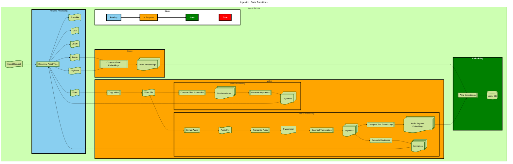

# Ingestion | State Transitions

```mermaid
---
title: "Ingestion | State Transitions"
---
%%{init: {'theme':'forest'}}%%
flowchart TD


    %% REQUEST %%
    subgraph ingest-service [Ingest Service]
        request@{ shape: paper-tape, label: "Ingest Request" }

        %% ASSET %%
        subgraph asset-processor [Request Processing]
            determine-asset-type[[Determine Asset Type]]
            asset-image@{ shape: paper-tape, label: "Image" }
            asset-keyframe@{ shape: paper-tape, label: "Keyframe" }
            asset-video@{ shape: paper-tape, label: "Video" }
            asset-folder@{ shape: paper-tape, label: "Folderlike" }
            asset-csv@{ shape: paper-tape, label: "CSV" }
            asset-json@{ shape: paper-tape, label: "JSON" }
        end

        %% IMAGE %%
        subgraph image-processing [Image]
            compute-visual-emb[[Compute Visual Embeddings]]
            embeddings-visual@{ shape: docs, label: "Visual Embeddings" }
        end

        %% VIDEO %%
        subgraph video-processing [Video]
            copy-video[[Copy Video]]
            video-file@{ shape: paper-tape, label: "Video File" }

            %% SHOTS %%
            subgraph shots-processing [Shots Processing]
                compute-shot-boundaries[[Compute Shot Boundaries]]
                shots@{ shape: docs, label: "Shot Boundaries" }
                generate-shot-kf[[Generate Keyframes]]
                shot-kfs@{ shape: docs, label: "Keyframes" }
            end

            %% AUDIO %%
            subgraph audio-processing [Audio Processing]
                extract-audio[[Extract Audio]]
                audio-file@{ shape: paper-tape, label: "Audio File" }

                %%transcribe-segment-audio[[Transcribe & Segment Audio]]
                transcribe-audio[[Transcribe Audio]]
                transcription@{ shape: doc, label: "Transcription" }
                segment-audio[[Segment Transcription]]
                segments@{ shape: docs, label: "Segments" }

                compute-text-emb[[Compute Text Embeddings]]
                embeddings-segments@{ shape: docs, label: "Audio Segment Embeddings" }

                generate-audio-kf[[Generate Keyframes]]
                audio-kfs@{ shape: docs, label: "Keyframes" }
            end
        end

        %% EMBEDDING %%
        subgraph embedding-processing [Embedding]
            write-emb[[Write Embeddings]]
            db-emb@{ shape: cyl, label: "Vector DB" }
        end

        %% STATES %%
        subgraph states ["States"]
            pending["Pending"]
            in-progress["In Progress"]
            done["Done"]
            error["Error"]
        end

    end

    %% ASSET
    request --> determine-asset-type
    determine-asset-type
        --> asset-folder
    determine-asset-type
        --> asset-csv
    determine-asset-type
        --> asset-json
    determine-asset-type
        --> asset-image
    determine-asset-type
        --> asset-keyframe
    determine-asset-type
        --> asset-video

    asset-image --> compute-visual-emb
    asset-keyframe --> compute-visual-emb
    asset-video --> copy-video

    %% IMAGE
        compute-visual-emb --> embeddings-visual

    %% VIDEO
    copy-video
        --> video-file
        --> compute-shot-boundaries --> shots
        --> generate-shot-kf --> shot-kfs

    %% AUDIO
    video-file
        --> extract-audio --> audio-file
        %%--> transcribe-segment-audio --> segments
        --> transcribe-audio --> transcription
        --> segment-audio --> segments
        --> compute-text-emb --> embeddings-segments
    segments
        --> generate-audio-kf --> audio-kfs

    %% KEYFRAMES
    shot-kfs --> determine-asset-type
    audio-kfs --> determine-asset-type

    %% EMBEDDINGS
    embeddings-visual --> write-emb
    embeddings-segments --> write-emb
    write-emb --> db-emb

    classDef Pending fill:#89CFF0,color:black,stroke:black,stroke-width:5px
    classDef InProgress fill:orange,font-weight:italic,stroke:black,stroke-width:5px
    classDef Done fill:green,color:white,stroke:black,font-weight:bold,stroke-width:5px
    classDef Error fill:red,color:white,stroke:black,font-weight:bold,stroke-width:5px

    asset-folder ~~~ pending ==> in-progress ==> done ~~~ error


    classDef Legend fill:white,color:black,stroke:black,stroke-width:5px
    class states, Legend
    class pending, Pending
    class in-progress, InProgress
    class done, Done
    class error, Error

    class asset-processor, Pending
    class image-processing,video-processing,audio-processing,shots-processing, InProgress
    class embedding-processing Done
```
```mermaid
info
```
